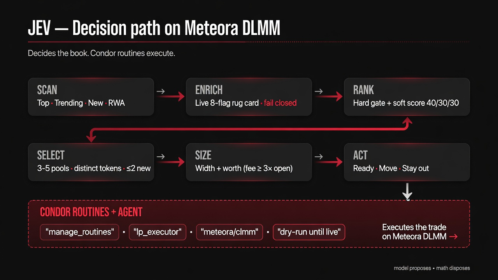

# JEV — Decision Maker at Meteora

A Condor trading agent where **one structured-decision model** ranks the live
Meteora DLMM universe, runs live rug cards, and holds a **portfolio of 3–5
pools** — and you can read every verdict.

Not a hummingbot/condor fork. Drop `agents/jev/` into a Condor checkout.

## Why the name JEV

Named after **Jev**, TypeSafe AI's flagship **System One model** — the first
model built to make decisions *inside software* rather than to chat. You send it
a `state` and typed questions; it returns typed answers with calibrated
confidence, not prose to parse.

That is the shape this agent needs, so Jev supplies its judgement:

- one **Noul** question per candidate — *"should this pair earn one of the
  slots?"* — all asked in a **single** fan-out call, so the reply is a ranking
  rather than a queue of prompts;
- a **Score** question for sizing — *what fraction of the book?*

The model proposes; `_jev_math` clamps every answer to the role envelope and can
still refuse it. With no key the desk runs on pure math.

- Console: <https://console.typesafe.ai/home>
- Docs: <https://docs.typesafe.ai> · model tag `jev-latest` (override with `TYPESAFE_MODEL`)

## The idea

Most bots hard-code a pool. JEV watches a model read the live Meteora tape and
decide — then executes one-sided liquidity walls it can defend.

- **Scan** Top / Trending / New / RWA.
- **Enrich** with live eight-flag rug cards (fail closed).
- **Rank** hard gates first, then soft score (fee yield · depth · clean · tab).
- **Select** 3–5 distinct tokens (≤2 from New), under a slot budget — one
  `Noul` question per candidate in a single System One call.
- **Size** % of book + width; **cost tier** (fee ≥ 1.2× open cost = full slice,
  trimmed down to 0.5×, below that no slice).
- **Gate** WAIT / SHIFT / REBUILD / SIT per pool (Ready / Move / Stay out in plain talk).

The model proposes (a `Noul` fan-out for selection + a `Score` for size). The
math disposes (rug card, bins, worth, dry-run). Every verdict carries the
probability or confidence behind it, journaled.

## Architecture

```
jev_scan        → Meteora DLMM universe (tabs, depth, vol, fee, bins)
jev_enrich      → live eight-flag rug cards → flags + rug_noul
jev_rank        → hard gate + composite (yield · depth · clean · tab)
jev_select      → portfolio Noul fan-out: top 3–5 distinct bases
jev_size        → Score: % of book + width + cost tier
jev_gate        → fee-vs-cost, BUY/SELL side, one verb per pool
     ↓
YOU             → SELECT / SIZE / WAIT / SHIFT / SIT / LEARN, then journal
```

TypeSafe System One via `jev-latest`. With no API key (or no SDK), pure math
keeps the desk running — the model is an advisor, never a hard requirement.

## Run modes

Two profiles. Switching is **one command**:

```bash
python agents/jev/set_mode.py prod   # 800 USDC / 5 slots / 50.0 floor
python agents/jev/set_mode.py test   # 100 USDC / 2 slots /  12.0 floor
python agents/jev/set_mode.py        # report the current mode, change nothing
```

Then restart the desk. The command rewrites `mode:` in `strategy.md` **and** the
values it couples, so they cannot drift apart:

| Mode | Book | Slots | Min slice | Per-pool cap | Risk ceiling | Use |
|---|---|---|---|---|---|---|
| `test` *(default)* | 100 USDC | 2 | 12.0 | 0.50 | 100 | organizers, constrained testing |
| `prod` | 800 USDC | 5 | 50.0 | 0.20 | 800 | the 48-hour competition envelope |

`_jev_math` reads `strategy.md`'s `mode:` key at import, so the routine defaults
and the dashboard both follow — nothing else needs editing. `$JEV_MODE` overrides
the file per process, for an organizer who would rather pin a profile from the
env:

```bash
JEV_MODE=prod python dashboard/live_bridge.py 8099
```

The book, the slot budget and the per-position floor move **together** on
purpose: a 2-slot budget on an 800 USDC book would open $400 walls, and a 5-slot
budget on a 100 USDC book would open dust under the fee-vs-cost floor. The risk
ceiling moves with them — sit it below the largest slice the cap permits and
Condor's risk gate refuses every open the mode just authorised. An unrecognised
mode name falls back to `test` rather than raising, so a typo cannot take the
desk down mid-run. Profiles live in `MODE_PROFILES` in
`agents/jev/routines/_jev_math.py`.

## Run the tests

```bash
python agents/jev/tests/test_jev_math.py       # pure-logic checks
python agents/jev/tests/test_jev.py            # SDK/decision checks
python agents/jev/tests/test_jev_transport.py  # wire contract vs the real SDK
```

The last one drives the real `typesafe_sdk` client against a mock HTTP
transport, so the request the desk puts on the wire (Noul fan-out, Score
levels, `jev-latest`) is asserted without a key. Dependencies:
`agents/jev/requirements.txt`.

## Safety invariants

- Dry-run by default. Live only when session note `jev.live` is exactly `yes`.
- Eight-flag rug card blocks dirty books before size.
- Cost tier scales the slice (fee ≥ 1.2× open cost = full, ≥ 0.5× = trimmed, below = no slice).
- Bin widths clamp to Meteora's on-chain limit (< 69 bins).
- One-sided only: BUY wall under price, re-sited to SELL after a fill.
- No second venue. No DAMM path. No inventing pools when scan is empty.

## Dashboard

`dashboard/` holds the decision desk.

```bash
python dashboard/live_bridge.py 8099   # live: serves index.html off a real desk
python dashboard/sim_jev.py            # offline: drives the same page with mock data
```

`index.html` polls `/state.json` every 2.5s, so the page updates on its own —
positions, decisions, trades and the confidence stream all move live.

The bridge carries **no host paths, account ids or credentials**. It reads
everything from the environment:

| Variable | Default | Purpose |
|---|---|---|
| `CONDOR_HOME` | `~/condor` | Condor checkout (also put on `sys.path`) |
| `JEV_STATE_DIR` | `$CONDOR_HOME/state` | routine snapshots |
| `CONDOR_USER_ID` | `0` | user whose memory store holds the `jev.live` gate |
| `JEV_MEMORY_DIR` | derived from the two above | memory store directory |
| `HUMMINGBOT_API_URL` | `http://127.0.0.1:8000` | Hummingbot API base |
| `HUMMINGBOT_API_USER` / `HUMMINGBOT_API_PASS` | `admin` / *(empty)* | API basic auth |

The Hummingbot API silently falls back to `admin/admin` when unauthenticated, so
a missing password surfaces as an auth failure rather than a config error.

## Decision path art



## Validating the agent

`agents/jev/tests/validate_agent.py` checks routine discovery, the routine
contract, strategy loading, and that no sibling entry or model-provider name
leaked into the agent's own instructions. The deny-lists are **not hardcoded** —
supply them locally (a public repo naming those entries would be the very leak
the check exists to catch):

```bash
JEV_SIBLING_MARKERS="slug_a,slug_b" JEV_PROVIDER_STRINGS="provider_a" \
  python agents/jev/tests/validate_agent.py
# or drop .sibling-markers / .provider-strings at the repo root (gitignored)
```
